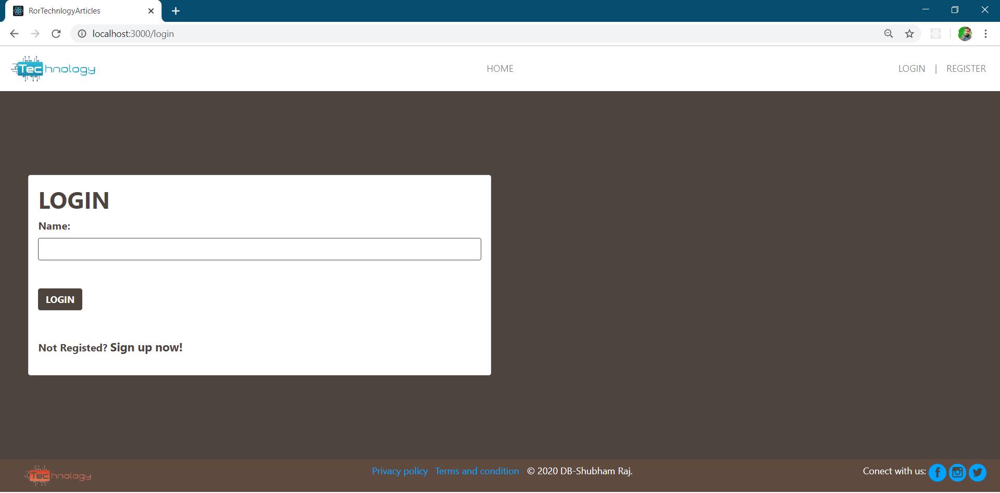
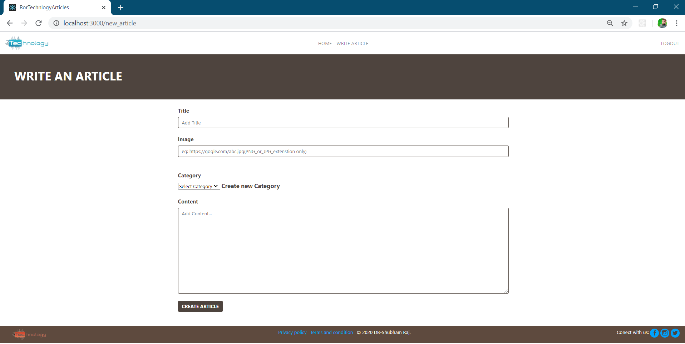

# Technology Article App on Ruby on Rails

[![Contributors][contributors-shield]][contributors-url]
[![Forks][forks-shield]][forks-url]
[![Stargazers][stars-shield]][stars-url]
[![Issues][issues-shield]][issues-url]

The project is build for the Ruby on Rails capstone from Microverse which is based on Technology Articles website. It is a website with articles on latest technologies.

### Home Page


### Login Page



### Signup Page


### Notice after Successfull LogIn


### Writing Articles



### Viewing Articles by Categories


## Live Link

[Live Version](https://polar-tundra-57268.herokuapp.com/login)

### Live Version


## Built With

- Ruby v2.6.6
- Ruby on Rails v5.2.4

## Getting Started

To get started with the app, cd to the directory where you would like the repo to live by typing on your terminal:

```
$ cd <directory>
```

Clone the repo typing:

```
$ git clone https://github.com/shubham14p3/ror-techno-articles.git
```

Install the needed gems:

```
$ bundle install
```

and then

```
$ rake db:setup

```


Next, migrate the database:

```
$ rails db:migrate
```

Finally, start server:

```
$ rails server
```

Open `http://localhost:3000/` in your browser.

### Prerequisites (Minimum)

Ruby: 2.6.6
Rails: 5.2.3
Postgres: >=9.5

### Run tests

```
    rpsec --format documentation { path }
```


### Deployment

#### Heroku

  Create a Heroku App

  ```
      $ heroku create
  ```
  Push the changes to the Heroku App

  ```
      $ git push heroku master
  ```

  Make a migration to the Heroku App

  ```
      $ heroku run rails db:migrate
  ```
## Note

- Try to use images in dark solid background it will improve the styling.
- If there is any Ruby version mismatch, you can replace the version between (2.6.6 to 2.7.0)

## Authors

👤 **Shubham Raj**

- Github: [@ShubhamRaj](https://github.com/shubham14p3)
- Linkedin: [Shubham14p3](https://www.linkedin.com/in/shubham14p3/)

## 🤝 Contributing

Contributions, issues and feature requests are welcome!

Feel free to check the [issues page](https://github.com/shubham14p3/ror-techno-articles/issues).

## Show your support

Give a ⭐️ if you like this project!

## Acknowledgments

- Project requested by [Microverse Program](https://www.microverse.org/).


<!-- MARKDOWN LINKS & IMAGES -->

[contributors-shield]: https://img.shields.io/github/contributors/shubham14p3/members-only.svg?style=flat-square
[contributors-url]: https://github.com/shubham14p3/ror-techno-articles/graphs/contributors
[forks-shield]: https://img.shields.io/github/forks/shubham14p3/members-only.svg?style=flat-square
[forks-url]: https://github.com/shubham14p3/ror-techno-articles/network/members
[stars-shield]: https://img.shields.io/github/stars/shubham14p3/members-only.svg?style=flat-square
[stars-url]: https://github.com/shubham14p3/ror-techno-articles/stargazers
[issues-shield]: https://img.shields.io/github/issues/shubham14p3/members-only.svg?style=flat-square
[issues-url]: https://github.com/shubham14p3/ror-techno-articles/issues
